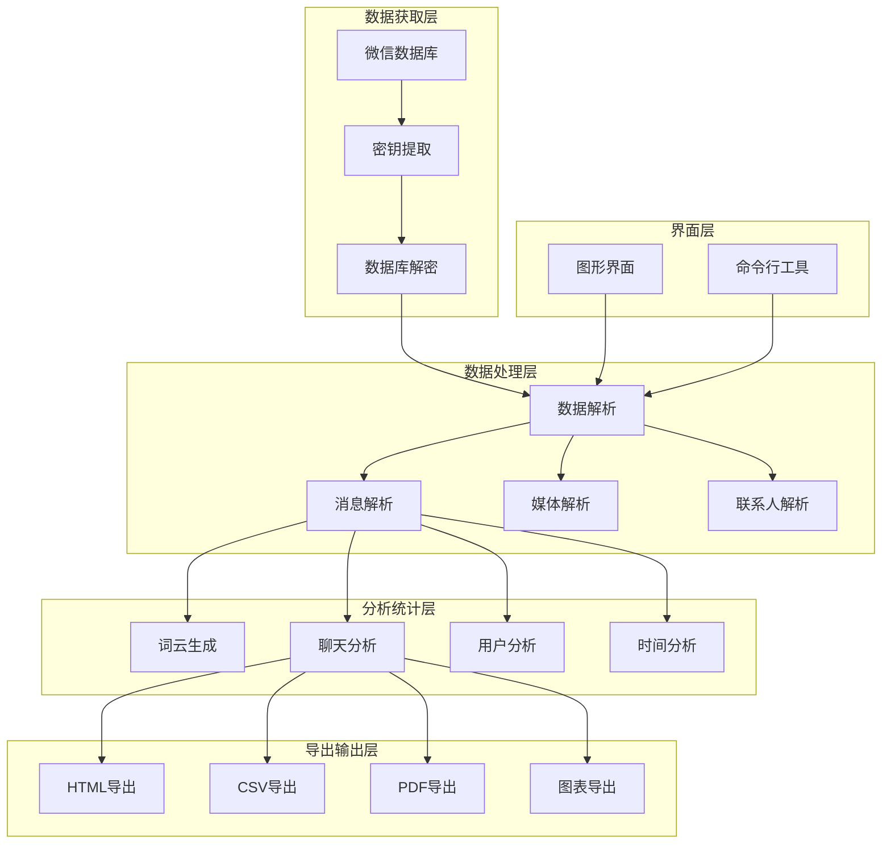

# 💬 fork-WeChatMsg - 微信消息导出工具


## 📦 项目来源

- **原项目**: [LC044/WeChatMsg](https://github.com/LC044/WeChatMsg)
- **原作者**: LC044
- **开源协议**: GNU General Public License v3.0 (GPL-3.0)
- **Fork时间**: 2024年

## 🔧 二次开发内容

本项目为原项目的学习研究版本,主要用于:
- 学习微信数据库的解密和数据提取
- 研究数据可视化和统计分析技术
- 了解GUI应用的开发方法

## ⚠️ 免责声明

本项目仅供学习研究使用,请勿用于非法用途。使用本项目所产生的一切后果由使用者自行承担。

## 📖 项目简介

fork-WeChatMsg是微信PC端消息记录导出与分析工具,支持导出聊天记录、联系人、图片视频等数据,并提供数据统计和可视化分析功能。

## 🏗️ 系统架构



## ⚠️ 免责声明

**本项目仅供个人学习和研究使用,请勿用于非法用途。使用本项目所产生的一切后果由使用者自行承担。**

## 🚀 快速开始

### 环境要求

- Python 3.8+
- 微信PC版(最新版本)

### 安装步骤

```bash
# 1. 克隆项目
git clone https://github.com/yourusername/fork-WeChatMsg.git

# 2. 安装依赖
pip install -r requirements.txt

# 3. 运行图形界面
python main.py

# 4. 运行命令行工具
python main_cli.py --help
```

## 🛠️ 技术栈

| 技术 | 版本 | 说明 |
|------|------|------|
| Python | 3.8+ | 编程语言 |
| PyQt5 | 5.x | GUI框架 |
| SQLite | - | 数据库 |
|jieba| - | 中文分词 |
| WordCloud | - | 词云生成 |
| Matplotlib | - | 数据可视化 |
| Pandas | - | 数据分析 |

## 📁 项目结构

```
fork-WeChatMsg/
├── app/
│   ├── ui/                    # 图形界面
│   │   ├── main_window.py
│   │   ├── chat_window.py
│   │   └── analysis_window.py
│   ├── analysis/              # 数据分析
│   │   ├── wordcloud.py      # 词云分析
│   │   ├── chat_analysis.py  # 聊天分析
│   │   └── user_analysis.py  # 用户分析
│   ├── export/                # 数据导出
│   │   ├── html_export.py
│   │   ├── csv_export.py
│   │   └── pdf_export.py
│   ├── decrypt/               # 数据解密
│   │   ├── get_key.py        # 获取密钥
│   │   └── decrypt_db.py     # 解密数据库
│   └── util/                  # 工具函数
│       ├── database.py
│       └── parser.py
├── resource/                  # 资源文件
├── tests/                     # 测试代码
├── main.py                    # 图形界面入口
├── main_cli.py                # 命令行入口
└── requirements.txt           # 依赖配置
```

## 💡 核心示例

### 数据库解密

```python
import hashlib

class WeChatDecryptor:
    """微信数据库解密器"""
    
    def __init__(self):
        self.key = None
    
    def get_wechat_key(self):
        """获取微信数据库密钥"""
        # 从微信进程内存中提取密钥
        # 具体实现涉及内存读取和解析
        pass
    
    def decrypt_database(self, db_path: str, output_path: str):
        """解密微信数据库"""
        # 使用获取的密钥解密数据库
        import pysqlcipher3.dbapi2 as sqlite
        
        conn = sqlite.connect(db_path)
        cursor = conn.cursor()
        
        # 设置密钥
        cursor.execute(f"PRAGMA key = 'x\'{self.key}\''")
        
        # 导出解密后的数据库
        cursor.execute("ATTACH DATABASE '{}' AS plaintext KEY ''".format(output_path))
        cursor.execute("SELECT sqlcipher_export('plaintext')")
        
        conn.close()
```

### 消息解析

```python
from dataclasses import dataclass
from datetime import datetime
from typing import List, Optional

@dataclass
class WeChatMessage:
    """微信消息数据结构"""
    msg_id: int
    talker: str                    # 聊天对象
    sender: str                    # 发送者
    content: str                   # 消息内容
    msg_type: int                  # 消息类型
    create_time: datetime          # 创建时间
    media_path: Optional[str]      # 媒体路径
    
class MessageParser:
    """消息解析器"""
    
    def __init__(self, db_path: str):
        self.db_path = db_path
    
    def parse_messages(self, talker: str) -> List[WeChatMessage]:
        """解析指定聊天对象的所有消息"""
        import sqlite3
        
        conn = sqlite3.connect(self.db_path)
        cursor = conn.cursor()
        
        # 查询消息记录
        cursor.execute(
            """SELECT msgId, talker, sender, content, type, createTime, mediaPath
               FROM MSG WHERE talker = ?
               ORDER BY createTime ASC""",
            (talker,)
        )
        
        messages = []
        for row in cursor.fetchall():
            message = WeChatMessage(
                msg_id=row[0],
                talker=row[1],
                sender=row[2],
                content=row[3],
                msg_type=row[4],
                create_time=datetime.fromtimestamp(row[5]),
                media_path=row[6]
            )
            messages.append(message)
        
        conn.close()
        return messages
    
    def parse_contacts(self) -> List[dict]:
        """解析联系人列表"""
        import sqlite3
        
        conn = sqlite3.connect(self.db_path)
        cursor = conn.cursor()
        
        cursor.execute("SELECT * FROM Contact")
        
        contacts = []
        for row in cursor.fetchall():
            contact = {
                'username': row[0],
                'alias': row[1],
                'nickname': row[2],
                'remark': row[3]
            }
            contacts.append(contact)
        
        conn.close()
        return contacts
```

### 数据分析

```python
from wordcloud import WordCloud
import jieba
from collections import Counter

class ChatAnalyzer:
    """聊天数据分析器"""
    
    def __init__(self, messages: List[WeChatMessage]):
        self.messages = messages
    
    def generate_wordcloud(self, output_path: str):
        """生成词云"""
        # 合并所有消息内容
        text = ' '.join([msg.content for msg in self.messages])
        
        # 中文分词
        words = jieba.cut(text)
        word_list = ' '.join(words)
        
        # 生成词云
        wordcloud = WordCloud(
            font_path='simhei.ttf',
            width=800,
            height=600,
            background_color='white'
        ).generate(word_list)
        
        # 保存词云图片
        wordcloud.to_file(output_path)
    
    def analyze_by_time(self) -> dict:
        """按时间分析聊天频率"""
        time_stats = {}
        
        for msg in self.messages:
            hour = msg.create_time.hour
            time_stats[hour] = time_stats.get(hour, 0) + 1
        
        return time_stats
    
    def analyze_by_user(self) -> dict:
        """按用户分析消息数量"""
        user_stats = {}
        
        for msg in self.messages:
            user_stats[msg.sender] = user_stats.get(msg.sender, 0) + 1
        
        return user_stats
    
    def get_most_common_words(self, top_n: int = 20) -> List[tuple]:
        """获取最常用的词汇"""
        # 合并所有消息内容
        text = ' '.join([msg.content for msg in self.messages])
        
        # 中文分词
        words = jieba.cut(text)
        
        # 过滤停用词
        with open('stopwords.txt', 'r', encoding='utf-8') as f:
            stopwords = set(f.read().splitlines())
        
        filtered_words = [word for word in words 
                         if word not in stopwords and len(word) > 1]
        
        # 统计词频
        word_counts = Counter(filtered_words)
        
        return word_counts.most_common(top_n)
```

### 数据导出

```python
import pandas as pd
from datetime import datetime

class DataExporter:
    """数据导出器"""
    
    def export_to_html(self, messages: List[WeChatMessage], output_path: str):
        """导出为HTML格式"""
        html_template = """
        <!DOCTYPE html>
        <html>
        <head>
            <meta charset="UTF-8">
            <title>微信聊天记录</title>
            <style>
                .message {{
                    margin: 10px 0;
                    padding: 10px;
                    border-radius: 5px;
                }}
                .sent {{
                    background-color: #95EC69;
                    text-align: right;
                }}
                .received {{
                    background-color: #FFFFFF;
                    text-align: left;
                }}
            </style>
        </head>
        <body>
            <h1>微信聊天记录导出</h1>
            <div class="chat-container">
                {messages}
            </div>
        </body>
        </html>
        """
        
        messages_html = ""
        for msg in messages:
            msg_class = "sent" if msg.sender == "self" else "received"
            messages_html += f"""
                <div class="message {msg_class}">
                    <div class="time">{msg.create_time.strftime('%Y-%m-%d %H:%M:%S')}</div>
                    <div class="content">{msg.content}</div>
                </div>
            """
        
        html_content = html_template.format(messages=messages_html)
        
        with open(output_path, 'w', encoding='utf-8') as f:
            f.write(html_content)
    
    def export_to_csv(self, messages: List[WeChatMessage], output_path: str):
        """导出为CSV格式"""
        data = []
        
        for msg in messages:
            data.append({
                '消息ID': msg.msg_id,
                '聊天对象': msg.talker,
                '发送者': msg.sender,
                '消息内容': msg.content,
                '消息类型': msg.msg_type,
                '创建时间': msg.create_time.strftime('%Y-%m-%d %H:%M:%S'),
                '媒体路径': msg.media_path
            })
        
        df = pd.DataFrame(data)
        df.to_csv(output_path, index=False, encoding='utf-8-sig')
    
    def export_to_pdf(self, messages: List[WeChatMessage], output_path: str):
        """导出为PDF格式"""
        from reportlab.lib.pagesizes import A4
        from reportlab.pdfgen import canvas
        from reportlab.pdfbase import pdfmetrics
        from reportlab.pdfbase.ttfonts import TTFont
        
        # 注册中文字体
        pdfmetrics.registerFont(TTFont('SimHei', 'simhei.ttf'))
        
        c = canvas.Canvas(output_path, pagesize=A4)
        c.setFont('SimHei', 12)
        
        y_position = 750
        
        for msg in messages:
            # 检查是否需要换页
            if y_position < 50:
                c.showPage()
                c.setFont('SimHei', 12)
                y_position = 750
            
            # 绘制消息
            text = f"{msg.create_time.strftime('%Y-%m-%d %H:%M:%S')} - {msg.sender}: {msg.content}"
            c.drawString(50, y_position, text[:50])  # 限制每行长度
            
            y_position -= 20
        
        c.save()
```

### 图形界面

```python
from PyQt5.QtWidgets import QMainWindow, QApplication
from PyQt5.QtCore import Qt

class MainWindow(QMainWindow):
    """主窗口"""
    
    def __init__(self):
        super().__init__()
        
        self.setWindowTitle("微信消息导出工具")
        self.setGeometry(100, 100, 800, 600)
        
        # 初始化界面
        self.init_ui()
    
    def init_ui(self):
        """初始化界面组件"""
        # 创建菜单栏
        menubar = self.menuBar()
        
        # 文件菜单
        file_menu = menubar.addMenu('文件')
        
        import_action = QAction('导入数据库', self)
        import_action.triggered.connect(self.import_database)
        file_menu.addAction(import_action)
        
        export_action = QAction('导出数据', self)
        export_action.triggered.connect(self.export_data)
        file_menu.addAction(export_action)
        
        # 创建工具栏
        toolbar = self.addToolBar('工具')
        
        # 添加按钮
        decrypt_btn = QPushButton('解密数据库')
        decrypt_btn.clicked.connect(self.decrypt_database)
        toolbar.addWidget(decrypt_btn)
        
        analyze_btn = QPushButton('数据分析')
        analyze_btn.clicked.connect(self.analyze_data)
        toolbar.addWidget(analyze_btn)
    
    def import_database(self):
        """导入数据库"""
        file_path, _ = QFileDialog.getOpenFileName(
            self, '选择数据库文件', '', 'Database Files (*.db)'
        )
        
        if file_path:
            # 处理数据库导入
            pass
    
    def export_data(self):
        """导出数据"""
        file_path, _ = QFileDialog.getSaveFileName(
            self, '保存文件', '', 'HTML Files (*.html);;CSV Files (*.csv)'
        )
        
        if file_path:
            # 处理数据导出
            pass
    
    def decrypt_database(self):
        """解密数据库"""
        # 调用解密模块
        pass
    
    def analyze_data(self):
        """数据分析"""
        # 调用分析模块
        pass

if __name__ == '__main__':
    app = QApplication(sys.argv)
    window = MainWindow()
    window.show()
    sys.exit(app.exec_())
```

## 📊 功能截图

### 主界面


### 聊天记录


### 数据分析


## 🎯 核心特性

- **数据解密**: 自动获取密钥并解密微信数据库
- **多格式导出**: 支持HTML/CSV/PDF等多种格式
- **数据分析**: 词云、聊天频率、用户分析等
- **图形界面**: 友好的PyQt5图形界面
- **命令行**: 支持命令行批量操作
- **媒体导出**: 支持图片、视频、语音导出

## 📝 更新日志

### v1.0.0 (2024-01-01)
- ✨ 初始版本发布
- ✨ 完成数据库解密功能
- ✨ 完成消息解析功能
- ✨ 完成数据导出功能
- ✨ 完成数据分析功能
- ✨ 完成图形界面

## 👥 贡献指南

欢迎贡献代码!请遵循以下步骤:

1. Fork本仓库
2. 创建特性分支 (`git checkout -b feature/AmazingFeature`)
3. 提交更改 (`git commit -m 'Add some AmazingFeature'`)
4. 推送到分支 (`git push origin feature/AmazingFeature`)
5. 提交Pull Request

## 📄 许可证

本项目采用 MIT 许可证 - 查看 [LICENSE](LICENSE) 文件了解详情

## 📮 联系方式

项目维护者: JOSP Team

---

⭐ 如果这个项目对你有帮助,欢迎Star支持!
